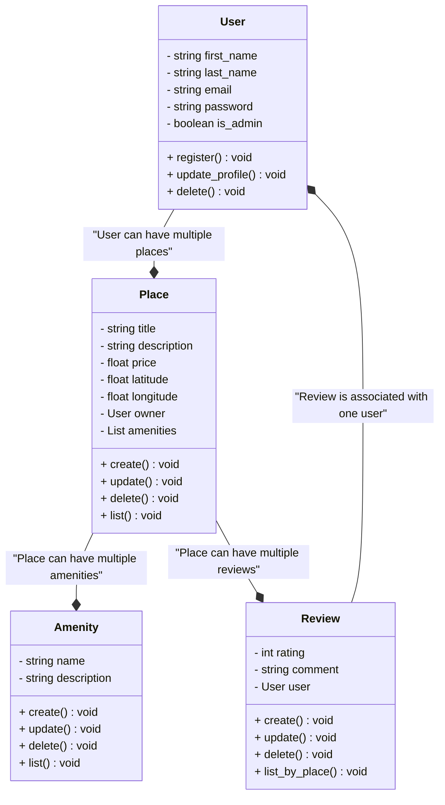
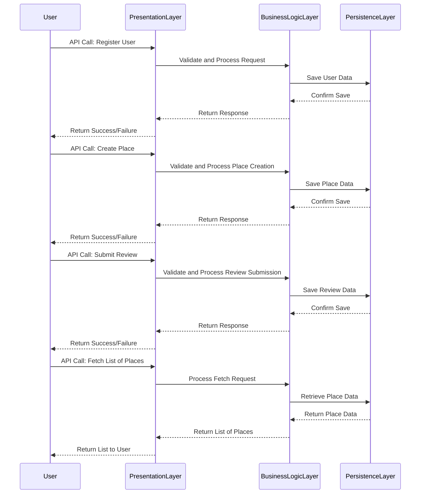

## Introduction

This document provides an overview of the layered architecture employed in the HBnH project, highlighting the separation of concerns across different layers and the key entities involved. This document will delve into the specifics of each layer, the entities they manage, and the design decisions that underpin the architecture.

## Package Diagram

This diagram illustrates a layered architecture for the HBnB project, utilizing interfaces and design patterns to separate concerns across three main layers:

````mermaid 
classDiagram
class PresentationLayer {
    +ServiceAPI
}
class BusinessLogicLayer {
    +User
    +Place
    +Review
    +Amenity
}
class PersistenceLayer {
    +DatabaseAccess
    +Repository
}
PresentationLayer --> BusinessLogicLayer : Facade Pattern
BusinessLogicLayer --> PersistenceLayer : Database Operations
````

### The 3 layers

- **PresentationLayer (User Interface)**: Interacts with the business logic through the `ServiceAPI` interface, abstracting the implementation details from the user.
- **BusinessLogicLayer (Business Logic)**: Contains core business entities: `User`, `Place`, `Review`, `Amenity`.
- **PersistenceLayer (Data Persistence)**: Manages data access and storage via `DatabaseAccess` and `Repository`.

### Entities

- **User**: Represents a platform user.
- **Place**: Represents a lodging or property.
- **Review**: Represents user reviews for places.
- **Amenity**: Represents available amenities in a place.

## Class Diagram

This section provides an overview of the key classes in the HBnB project, detailing their roles, key attributes, and relationships. This will serve as a reference for implementing robust and scalable business logic.



### Class: User

**Role**: Manage users.  
**Key Attributes**: email, password, is_admin.  
**Relationships**: A user can own multiple places (Place).

### Class: Place

**Role**: Represent an available place.  
**Key Attributes**: title, description, price.  
**Relationships**: 
- A place belongs to a user.
- A place can have multiple amenities (Amenity).
- A place can receive multiple reviews (Review).

### Class: Amenity

**Role**: Manage amenities associated with a place.  
**Key Attributes**: name, description.  
**Relationships**: Associated with one or more places.

### Class: Review

**Role**: Collect reviews for a place.  
**Key Attributes**: rating, comment.  
**Relationships**: 
- A review is linked to a place.
- A review is written by a user.

### Key Decisions

**Structure**:  
Each entity is autonomous with CRUD methods for management.

**Relationships**:  
Aggregations (e.g., User → Place) facilitate navigation while maintaining low dependency.

**Extensibility**:  
CRUD methods ensure easy scalability in case of adding new features.

## Sequence Diagram

This document provides an overview of the sequence diagram used in the project. The sequence diagram illustrates the interactions between different components of the system for various API calls.



## Diagram Overview

The sequence diagram includes the following participants:
- **User**: The end user interacting with the system.
- **PresentationLayer**: The layer responsible for handling API calls and returning responses to the user.
- **BusinessLogicLayer**: The layer responsible for validating and processing requests.
- **PersistenceLayer**: The layer responsible for saving and retrieving data from the database.

## API Calls

The sequence diagram covers the following API calls:
1. **Register User**: The process of registering a new user.
2. **Create Place**: The process of creating a new place.
3. **Submit Review**: The process of submitting a review for a place.
4. **Fetch List of Places**: The process of fetching a list of places.

### Register User

1. **User**: Initiates the API call to register a new user by providing necessary details such as username, email, and password.
2. **PresentationLayer**: Receives the request, validates the user input (e.g., checks if the email is in the correct format), and processes the registration request.
3. **BusinessLogicLayer**: Validates the business rules (e.g., checks if the username or email already exists) and interacts with the PersistenceLayer to save the user data.
4. **PersistenceLayer**: Saves the user data in the database and confirms the save operation.
5. **BusinessLogicLayer**: Returns the response (success or failure) to the PresentationLayer.
6. **PresentationLayer**: Returns the final response to the user, indicating whether the registration was successful or if there were any errors.

### Create Place

1. **User**: Initiates the API call to create a new place by providing details such as name, location, and description.
2. **PresentationLayer**: Receives the request, validates the place data (e.g., checks if all required fields are filled), and processes the creation request.
3. **BusinessLogicLayer**: Validates the business rules (e.g., checks if the place name is unique) and interacts with the PersistenceLayer to save the place data.
4. **PersistenceLayer**: Saves the place data in the database and confirms the save operation.
5. **BusinessLogicLayer**: Returns the response (success or failure) to the PresentationLayer.
6. **PresentationLayer**: Returns the final response to the user, indicating whether the place creation was successful or if there were any errors.

### Submit Review

1. **User**: Initiates the API call to submit a review for a place by providing details such as rating and comments.
2. **PresentationLayer**: Receives the request, validates the review data (e.g., checks if the rating is within the valid range), and processes the submission request.
3. **BusinessLogicLayer**: Validates the business rules (e.g., checks if the user has already reviewed the place) and interacts with the PersistenceLayer to save the review data.
4. **PersistenceLayer**: Saves the review data in the database and confirms the save operation.
5. **BusinessLogicLayer**: Returns the response (success or failure) to the PresentationLayer.
6. **PresentationLayer**: Returns the final response to the user, indicating whether the review submission was successful or if there were any errors.

### Fetch List of Places

1. **User**: Initiates the API call to fetch a list of places.
2. **PresentationLayer**: Receives the request and processes the fetch request.
3. **BusinessLogicLayer**: Interacts with the PersistenceLayer to retrieve the place data from the database.
4. **PersistenceLayer**: Retrieves the place data and returns it to the BusinessLogicLayer.
5. **BusinessLogicLayer**: Returns the list of places to the PresentationLayer.
6. **PresentationLayer**: Returns the list of places to the user, providing the requested data.

## Detailed Sequence Diagram

For a detailed view of the sequence diagram, refer to the `sequence_diagram.md` file. The diagram provides a visual representation of the interactions between the participants for each API call, showing the sequence of messages exchanged.

The sequence diagram helps in understanding the flow of data and the responsibilities of each layer in the system. It is a useful tool for both developers and stakeholders to visualize the system's behavior and ensure that all components are working together as expected.
