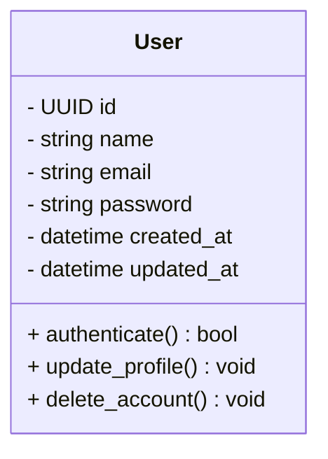

```mermaid
classDiagram
    class User {
        - UUID id
        - string name
        - string email
        - string password
        - datetime created_at
        - datetime updated_at
        + authenticate() bool
        + update_profile() void
        + delete_account() void
    }
```