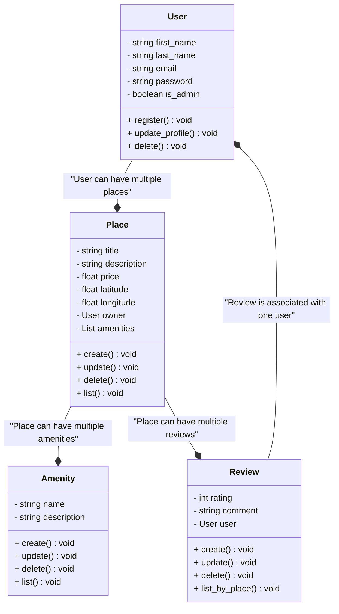

### **Résumé des Entités et Relations**

1. **Classe User**
    
    - **Rôle** : Gérer les utilisateurs.
    - **Attributs clés** : `email`, `password`, `is_admin`.
    - **Relations** : Un utilisateur peut posséder plusieurs lieux (`Place`).
2. **Classe Place**
    
    - **Rôle** : Représenter un lieu disponible.
    - **Attributs clés** : `title`, `description`, `price`.
    - **Relations** :
        - Un lieu appartient à un utilisateur.
        - Un lieu peut avoir plusieurs commodités (`Amenity`).
        - Un lieu peut recevoir plusieurs avis (`Review`).
3. **Classe Amenity**
    
    - **Rôle** : Gérer les commodités associées à un lieu.
    - **Attributs clés** : `name`, `description`.
    - **Relations** : Associée à un ou plusieurs lieux.
4. **Classe Review**
    
    - **Rôle** : Collecter les avis sur un lieu.
    - **Attributs clés** : `rating`, `comment`.
    - **Relations** :
        - Un avis est lié à un lieu.
        - Un avis est écrit par un utilisateur.

---

### **Décisions Clés**

1. **Structure** :  
    Chaque entité est autonome avec des méthodes CRUD pour la gestion.
    
2. **Relations** :  
    Les agrégations (e.g., `User` → `Place`) facilitent la navigation tout en maintenant une faible dépendance.
    
3. **Extensibilité** :  
    Les méthodes CRUD garantissent une capacité d'évolution simple en cas d'ajout de fonctionnalités.
    

---

### **Conclusion**

Ce diagramme illustre les relations essentielles et les responsabilités de chaque classe. Il servira de référence pour implémenter une logique métier robuste et évolutive.